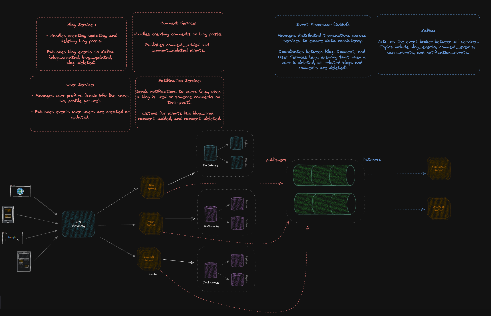

# Blogging Microservices

### NOTE: just for learning

Simple Micro-service app using Golang and FastAPI

## Table of Contents
- [Description](#description)
- [System Architecture](#system-architecture)
- [Features](#features)
- [Installation](#installation)
- [Usage](#usage)
- [Contributing](#contributing)
- [License](#license)

## Description
This repository implements a simple microservices application for a blogging platform using Golang and FastAPI. It serves as a learning project to explore new concepts in microservice architecture.

## System Architecture


## Features
### Microservices
- **API Gateway Service**: Acts as an entry point to the system, routing requests to the appropriate microservices.
- **User Service**: Manages user data and authentication using Golang.
- **Blog Service**: Handles blog post creation, updating, and deletion using Golang.
- **Analytics Service**: Collects and analyzes usage data using FastAPI.
- **Comment Service**: Manages comments on blog posts using FastAPI.

### Event-Driven Architecture
The system uses an event-driven architecture to decouple services and improve scalability. Kafka is used as the messaging system to publish and subscribe to events.

- **User Events**: Events like `UserCreated`, `UserUpdated`, and `UserDeleted` are published by the User Service to Kafka.
- **Blog Events**: Events like `BlogCreated`, `BlogViewed`, `BlogDeleted`, `BlogLiked`, `BlogDisliked`, and `BlogClapped` are published by the Blog Service to Kafka.
- **Comment Events**: The Comment Service consumes events such as `BlogViewed` to manage comment-related functionalities.

### Kafka Implementation
Kafka is used to handle the event-driven communication between microservices. The following Kafka-related configurations are used:

- **Kafka Publisher**: Each service has a Kafka publisher to send events to the Kafka topics.
- **Kafka Consumer**: Services can consume events from Kafka topics to perform specific actions based on the events.

## Installation
### Prerequisites
- [Go](https://golang.org/doc/install)
- [Docker](https://www.docker.com/get-started)
- [Kafka](https://kafka.apache.org/quickstart)
- [Python](https://www.python.org/downloads/)
- Fiber
- FastAPI

### Steps
1. Clone the repository:
    ```sh
    git clone https://github.com/a-samir97/go-microservices.git
    cd go-microservices
    ```

2. Build and run the services:
    ```sh
    docker-compose up --build
    ```

## Usage
### Running Services
Based on the Makefile, here is the updated "Running Services" section in the README file:

## Usage
### Running Services
You can use the provided Makefile to easily manage the services.

- **API Gateway Service**:
    ```sh
    make api-gateway-up
    ```

- **User Service**:
    ```sh
    make users-up
    ```

- **Blog Service**:
    ```sh
    make blogs-up
    ```

- **Analytics Service**:
    ```sh
    make analytics-up
    ```

- **Start All Services**:
    ```sh
    make up-all
    ```

- **Stop All Services**:
    ```sh
    make down-all
    ```

## Contributing
1. Fork the repository.
2. Create a new branch (`git checkout -b feature-branch`).
3. Make your changes.
4. Commit your changes (`git commit -m 'Add some feature'`).
5. Push to the branch (`git push origin feature-branch`).
6. Open a pull request.

## License
This project is licensed under the MIT License - see the [LICENSE](LICENSE) file for details.
